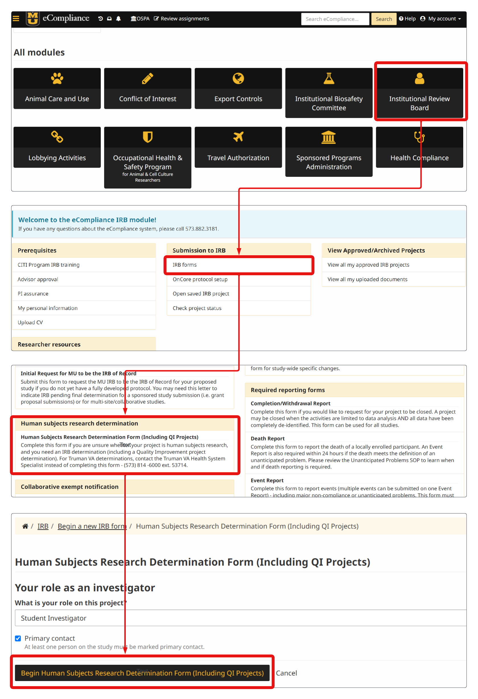
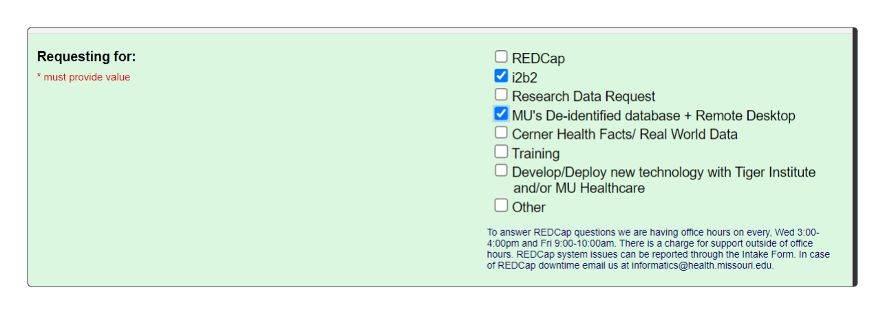

# End-of-Class Conversion to Long-term Access

Your access to our NextGen data lake will **expire at the end of the semester**. If you would like to retain your access to our **deidedntified** data lake, please following the steps below to convert to a study-specific account with dedicated, long-term access to our data lake (Snowflake and service workbench).

### Step 1. Non-Human-Subject Determination

- Go to: https://ecompliance.missouri.edu/
- Navigate to the "Non" form as shown in the figure below

- Complete the form and save the approval letter/email for use later. A sample letter can be found here: [sample NHS Determination Application](./sample-NHS-Determination-form.pdf). You may re-use some of the language regarding de-identified data source and de-identification process where you see fit. 

### Step 2. NextGen BMI Intake Process

- Go to: https://showmeportal.missouri.edu/redcap/surveys/?s=MCY9TRFEFPWDJ3EF 
- Complete all relevant forms for regaining access to: either or both access to a) i2b2 and b) MU De-identified Data lake and Remote Desktop

Note that each access to each tool will trigger a separate form, which need to be completed as well. 

### Step 3. Activate Accounts 

Once both steps are completed and approved, please be a lookout for account activation emails. Once account(s) are activated, you will be able to work on. Note that the de-identified data you will have access to will be refreshed on a monthly basis. 

